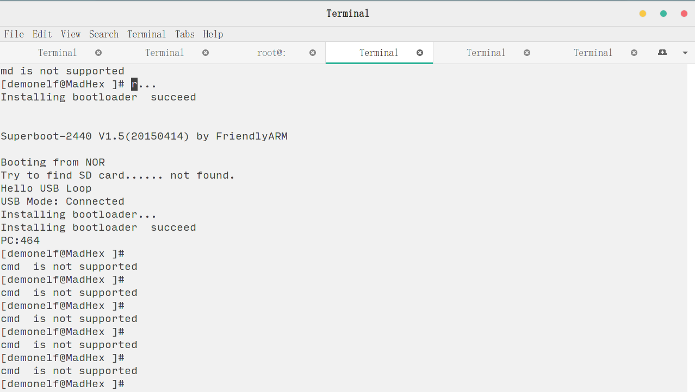
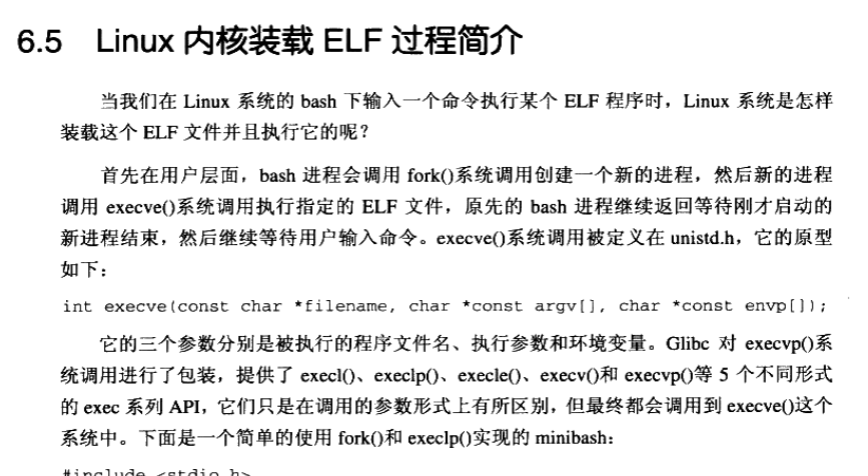
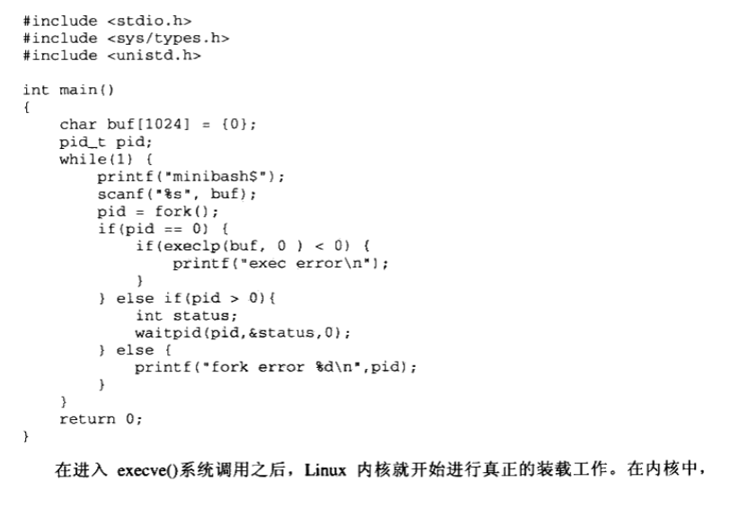
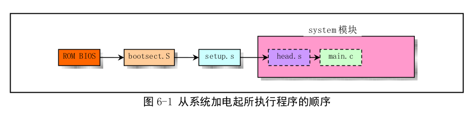
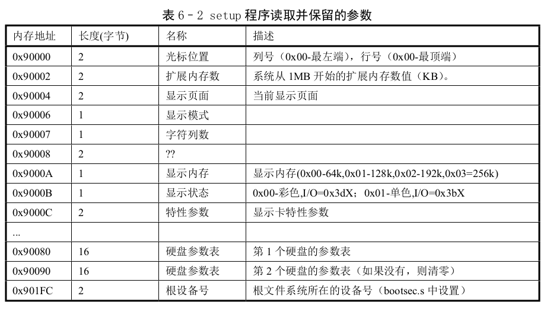
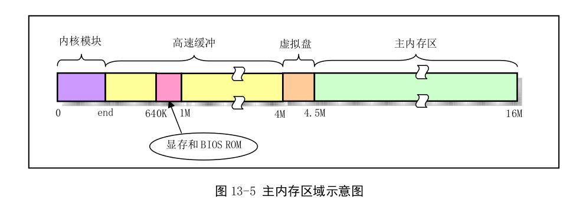
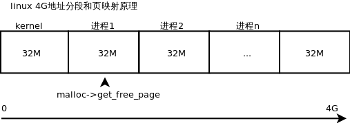

# legacy-arm-linux

### 我们的思想

### 

  1.  不扯淡不废话 直接动手干

  2.  做事接地气 不唱高调

  3.  不是为了做最好的程序员, 而是为了做一个快乐的小码农.

      ​


### 本代码目标


计划做一个简单arm版linux的视频教程和大家一起分享进步.

假设你已经学过了一个简单的bootload编写, 因为本视频并不想更多的关注硬件
只是希望在有简单裸板基础上,我们能更快的学习操作系统原理和理解实现简单的linux
熟悉linux内核的好处做为嵌入式的方向的z真很多.
无论未来是想做驱动 apue 内核优化还是等等 有内核基础就相当于有了内功.
我们此视频并不是想向其它视频一样 实现一个自己的os
而是想完全模拟linux 实现一个早期版本的linux内核
大家一定要注意我们说的是内核. 并不是一个操作系统
操作系统在有些时候分类是包含各种应用的.
而我们是想实现一个单一的内核,我们的内核也是支持posix标准
并且可以运行起来以posix标准开发的应用
至少我们要向linus最早实现的可以运行起来bash

我们并不注重gui的开发.因为在内核看来 gui也只是个应用 和其它的应用也没有太大区别
前期太多关注gui有可能让我们感到内核的混乱,

毕竟其他喜欢重点讲gui的人. 可能也只可能算是个噱头而已.
但我们并不排斥gui. 我希望为了这个噱头, 后期可以移植一个gui在我们的kernel上.

再回来强调下, 我们实现此视频是想学习内核原理和linux的构架实现.
深入了解linux, 在未来长期的开发是很有帮助的.

大家也不必担心此课程会很复杂和庞大. 因为如果大家已经有了一个裸板学习的基础,例如:能实现最简单的bootloder那么我们只要参考linux原型实现几个必要的操作系统部分就可以了 

例如: 内存管理 进程调度 文件系统等

最后强调一点,我们学习内核, 要有"亮独揽大略"的心胸 .


### 以下为计划进展


#### 第一步: 实现自我引导 初始化外设 和开启mmu一级页表

已经实现开启mmu, 下一步可以先写两个小程序 实现调度demo

本进展思路完全根据像linus的开发思路进行.目的不是想实现一个高可用的系统.

而是想学习操作原理和开发思路



#### 第二步: 先根据自己的思路实现一个简单的进程调度

1. 先实现一个任务式, 即一个任务完成再运行另一个任务
2. 实现时间片段的方式


实现进程调度 

我们首先应该考虑linux如何加载程序, 可以参考:







我编译用gcc 编译一个main.c 生成main

通过objdump -d main 我们发现包含了_start函数, 此函数我们编写

通过ldd main

	linux-vdso.so.1 (0x00007ffd7251d000)
	libc.so.6 => /lib64/libc.so.6 (0x00007fa2385e0000)
	/lib64/ld-linux-x86-64.so.2 (0x00007fa238991000)


肯定是它 没跑了/lib64/ld-linux-x86-64.so.2 (0x00007fa238991000)


#### 第三步: 完善和模仿linux0.12实现进程调度


#### 第四步: 实现内核接口,开启用户态


#### 第五步: 实现文件系统


### 以下为随手笔记还有待整理


arm 体系结构    : 冯诺依曼 哈佛 
arm 指令
启动流程:



setup需读取reg



​


1. 实现内存管理

   内存分布:

   

   ​

   扩展内存由来

   在386以上档次的微机中，有两种[存储器](https://baike.baidu.com/item/%E5%AD%98%E5%82%A8%E5%99%A8)工作方式，一种称为实地址方式或实方式，另一种称为保护方式。在实方式下，[物理地址](https://baike.baidu.com/item/%E7%89%A9%E7%90%86%E5%9C%B0%E5%9D%80)仍使用20位，所以最大[寻址空间](https://baike.baidu.com/item/%E5%AF%BB%E5%9D%80%E7%A9%BA%E9%97%B4)为1MB，以便与[8086](https://baike.baidu.com/item/8086)[兼容](https://baike.baidu.com/item/%E5%85%BC%E5%AE%B9)。保护方式采用32位[物理地址](https://baike.baidu.com/item/%E7%89%A9%E7%90%86%E5%9C%B0%E5%9D%80)，寻址范围可达4GB。[DOS](https://baike.baidu.com/item/DOS)系统在实方式下工作，它管理的[内存](https://baike.baidu.com/item/%E5%86%85%E5%AD%98)空间仍为1MB，因此它不能直接使用扩展[存储器](https://baike.baidu.com/item/%E5%AD%98%E5%82%A8%E5%99%A8)。为此，Lotus、Intel、AST及Microsoft公司建立了MS－DOS下扩展[内存](https://baike.baidu.com/item/%E5%86%85%E5%AD%98)的使用标准，即扩展[内存](https://baike.baidu.com/item/%E5%86%85%E5%AD%98)规范XMS。我们常在Config.sys文件中看到的Himem.sys就是管理扩展内存的[驱动程序](https://baike.baidu.com/item/%E9%A9%B1%E5%8A%A8%E7%A8%8B%E5%BA%8F)。

   扩展[内存](https://baike.baidu.com/item/%E5%86%85%E5%AD%98)管理规范的出现迟于[扩充内存](https://baike.baidu.com/item/%E6%89%A9%E5%85%85%E5%86%85%E5%AD%98)管理规范。


​	MMU下地址原理


​	


​	根据上面图示可以得知 linux在创建进程后就已经确定了虚拟地址

​	每个进程的大小和硬件mmu有很大关系​​


```
  /*0x30008000 0x8000=32k */
  /*0~0x4000存放Bootloader传递到Kernel的参数，
  /*0x4000~0x8000存放主页表*/
  /*PGD（arm页表项4byte，映射1M地址空间，4G空间大小需要4096个页表项，所以16k = 4byte * 4096）*/
```


调试命令记录:

#sudo openocd


telnet 127.0.0.1 4444

reset;halt

probe nand 0

nand erase 0 0 0x100000

nand write 0x0 /home/demonelf/project/00.mywork/legacy-arm-linux/u-boot.bin 0x0

halt;load_image /home/demonelf/project/00.mywork/legacy-arm-linux/u-boot.bin 0x30008000

resume 0x30008000


以上load_image 只有软件初始化ram后才可使用


arm-linux-gnueabihf-gdb

tui enable

file miniboot.elf

target remote 127.0.0.1


gdb 查看内存

(gdb) x	/3xw 0x30008000
0x30008000:     0xea000010	0xea000005	0xea000005

然后根据dump.asm对照